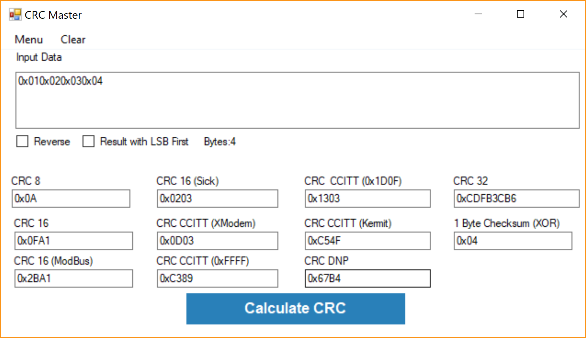

# CRCMaster
This project is a small C# program that allows to perform calculations of various types of CRC Values to the most common algorithms. It Allows to get the source code in C and C# to the desired algorithm.
I found this program very useful when implementing a new Firmware or software, that uses CRC calculations.

